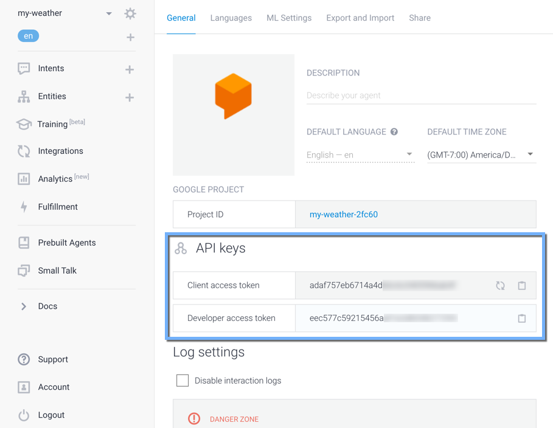

# dialogflow-tools

Simple CLI and JS module for interacting with the [Dialogflow V1 API](https://dialogflow.com/docs/reference/agent/)

You will need an access token to use the API. The developer access token is used for /intents and /entities endpoints. The client access token is used for /query, /contexts, and /userEntities endpoints.



## CLI

Install the CLI globally.

`npm install -g dialogflow-tools`

### Usage

View help: `dialogflow --help`

```
    # create entities for dev app
	dialogflow post entities --payload=path/to/entities.js --dev-token=./.dev-tokens/dev

    # update intents for prod app
	dialogflow put intents -p=path/to/intents.json -t=./.dev-tokens/prod

    # get an intent from dev app
	dialogflow get intents -t=./.dev-tokens/prod 05b02338-63b5-4a86-a08e-409ef5b5f208
    
    # get all intents and write to a file
	dialogflow get intents -t=./.dev-tokens/prod >> output.json
```


## Module

Install the module locally.

`npm install dialogflow-tools`

### Usage

Import the module

`const DF = require('dialogflow-tools')`

Set the access token. Either store in a .gitignore'd file, or retrieve from an environment variable.

```
    const devToken = require('./.access_tokens/dev')
    DF.setDevToken(devToken)
    DF.setClientToken(process.env.DIALOGFLOW_CLIENT_TOKEN)
```

Now you can call some methods! 

`DF.<method>(<type>, <opts>)`

The module uses a DF method named by REST commands (get, post, put, delete). 

Type is one of "intents" or "entities".

Opts contain an id for targeting a specific object, and a payload (json) for post / put requests.

```
    // get basic info for all intents
    DF.get('intents').then(intents => console.log(intents))
    
    // update an intent
    var opts = {id: uuid, payload: json}
    DF.put('intents', opts).then(...)

    // create an intent
    var opts = {payload: json}
    DF.post('intents', opts).then(...)
    
    // delete an intent
    var opts = {id: uuid}
    DF.delete('intents', opts).then(...)
```

## Running Tests

`npm test`

The tests require you to create a directory in tests/.access_tokens that should contain dev.txt and client.txt. These files need the client and dev tokens for your agent.